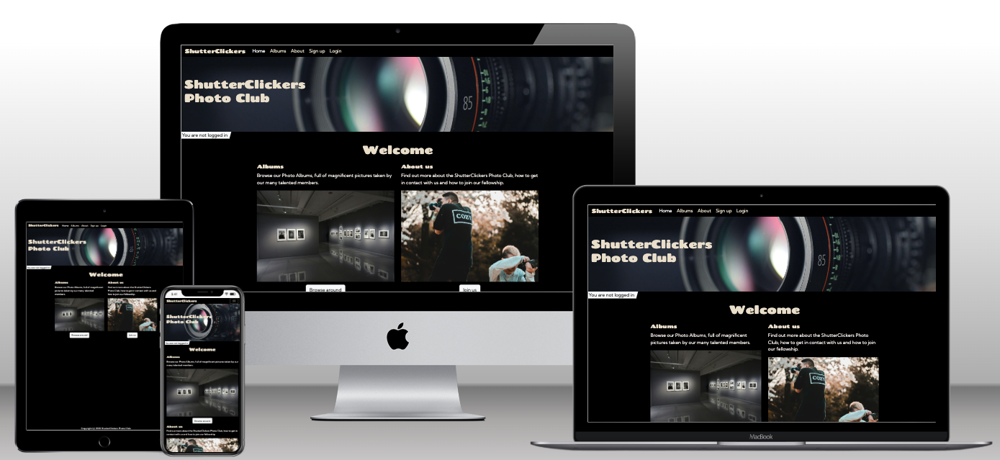
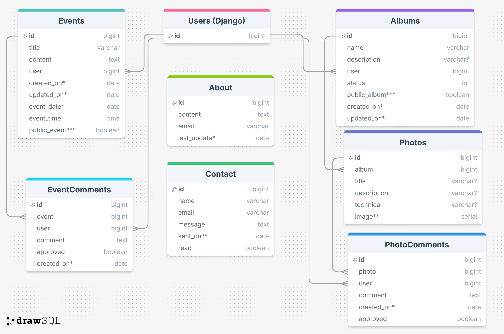
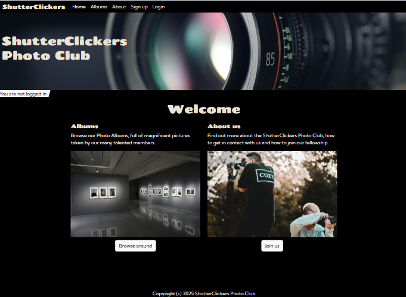
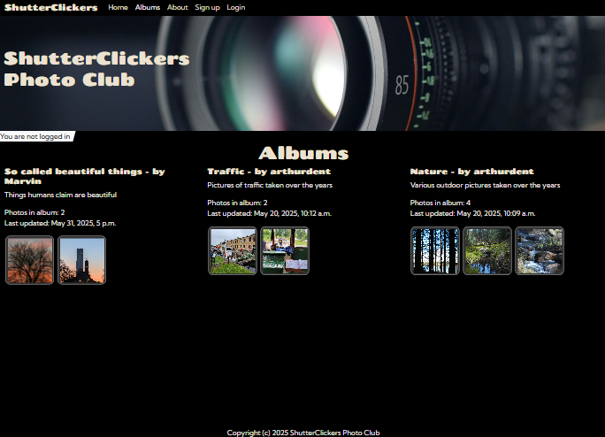
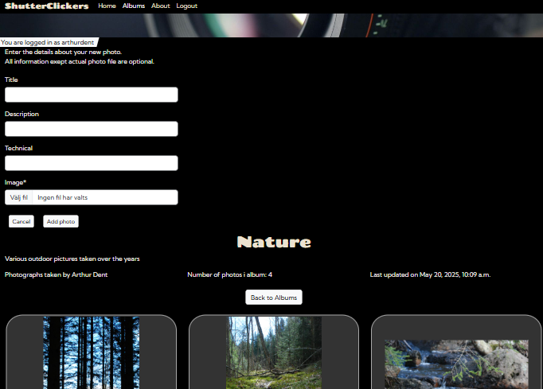
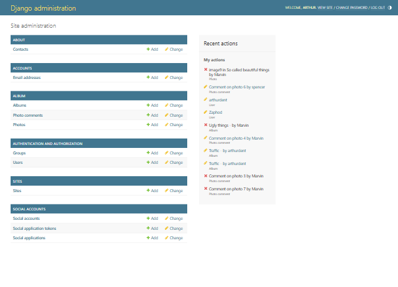

# Milestone Project 3 : The ShutterClickers Photo Club

Picture provided by mentor Spencer Barriball

## Table of contents

## Introduction

The ShutterClickers Photo Club is a ficticious photo club. Most of the members are students at the local university and are now looking for a website to post their pictures, both as a way to inspire each other and also promote the site to attract new members, both from the university and the surrounding community.

### Other ideas considered

The photo club was one of two ideas considered before project start. They were written upp in [Initial Ideas](static/readme/README_initial_ideas.md) and discussed with Code Institute Mentor Spencer Barriball. Considering the scope of the project and the timeframe involed, the idea of the probably more complicated quiz app was dropped in favor of the photography page.

## Goals

Provide a place to post photos taken by club members. The members would like the option of choosing wether an album/category would be open to all visitors or only to club members. The club also would like a way to announce excursions or other activities, and these would also be either private (club members only) or public. Only club members should be able to post pictures and create albums, but any registered user should be able to comment on public pictures or events.

## Overview of users and needs

The following hierarchy is displayed from lowest to highest access to the site. This means that Registered Users will also have all functionality granted to Visitor, Member will also have all functionality granted to Registered Users and Visitors.

**Visitors**: Visitors will be able to see all public photo albums and the pictures they contain, as well as see publically posted events. They will also be able to see all approved comments.

**Registered users:** Visitors can register to become a user. Users will be able to give feedback on pictuers and comment on upcoming events. The comments will need to be approved by a webmaster before becoming visible.

**Members:** Members will be able to create albums and post their pictures in them. Members will also be able to post feedback on pictures or comment events and their comments will be published immediately without waiting for webmasters approval.

**Webmasters:** One or a few webmasters will have total access to the site (Django admin role: superuser). Webmasters will grant membership status to those users who are paying members of the ShutterClickers Photo Club.

## User stories

Github Projects has been used throughout the project to keep track of these user stories and their progress. All criteria and tasks are also available in the Github Project. The progress on the board at the time of project submission shows their actual status.  
The Github Project is available at [https://github.com/users/Daniel-R-ci/projects/7](https://github.com/users/Daniel-R-ci/projects/7)

The following is a quick overview of the user stories that are being implemented. For a full description of all user stories accpetance criteria and Tasks, see [Full User Stories](static/readme/README_user_stories.md).

### Webmaster - Administration

As a ***webmaster***, I would ***need to have full access to the site*** in order to:  
- ***approve comments made by registered users***
- ***move users to Members group after becoming members of the photo club***
- ***grant superuser rights to new webmasters***
- ***in worst case suspend someones account***

### Member - Album and photo handling

As a ***member of the photo club***, I would like to **create albums and post my pictures to them** in order to ***show them to others***. 

### Member - Create events

As a ***member***, I would like to ***post information about upcoming events***, in order to ***meet other members and engage more in the hobby***.

***Note:*** Members should not be able to delete events. If an event is canceled, the event should be changed with the information that it has been canceled. If needed, webmaster can be contacted to delete all information about the event. 

### Members & Users - Give feedback on photographs

As a ***member or registered user***, I would like to ***give feedback or words of praise on pictures***, in order to ***give the photographer both confidence and a way to hone their skills***.

### Members & Users - Comment on upcoming events

As a ***member or registered user***, I would like to ***comment on upcoming events***, in order to ***ask for more information, announce my intention to attend etc***.

### User registration

As a ***visitor to the site***, I would like to ***register to become a user***, in order to ***interact more with the club and possibly become a member***.

## Club information

As a ***visitor or registered member***, I would like to have a way to ***get more information about the ShutterClickers Photo Club and if need be contact them with questions*** in order to ***learn more about the club and possibly decide to be a member***.

## Discussion of user stories

### Member - Post pictures

What kind of information will be needed for categories and pictures? In a category with a good name and a good description there may not be a need to give information about any specific picture, but in other albums there might be a need for it. From this follows than any information about a specific picture should be optional and not required. The information that can be posted will be a short description about the picture, and another field for technical information that the photographer may want to share (ISO, shutter speed and similar things).

## Basic design of website and page requirements

The website will be built with Python / Django framework. Custom Java Script will be used to enhance user experience when needed. Bootstrap will be used to make the website responsive to different screen sizes and access both css and functionality.

The following pages/views will be accomondated:

- **Index**, the introductionary page to the website
- **Albums**, browse photos by albums
- **Photos**, bigger rendering of picture together with comment section
- **Events**, read about upcoming events and comment on them
- **Login** / **logout** / **signup**, will be handled with Django auth apps
- **Admin**, will be handled with Django Admin interface
- **About/contact**, for information about the Shutterclickers Photo Club, including contact form

## MVP Priority
(MVP- Minimal Viable Product)

The prefered index page/view is relatively complex and uses several functions to give an overwiev of what is happening on the site. It will present what is going on without having to browse around the entire site to get updated. Due to time restraints, this page will only be implemented if there is time remaining at the end of the project. Therefore, a MVP version will be constructed first to create a pleasing and welcoming entrance but without the desired functionality since focus should be on getting the core functions working in their respective pages/views before launch. Wireframes for both versions are presented in next chapter.

Getting the photo album part of the web page also has a higher priority than getting the events section up an running

Another feature that will be implemented if time permits is album and photo functionality (CRUD management) via the public website (though controlled by login). To get a MVP website up and running as soon as possible, these functions will initially be handled through Djangos Admin interface, where club members will have Group Permission to perform some of these functions in the Admin interface. They will not however have the same access as the Superuser(s) / Webmasters.

The priorities in the beginning of the project was therefore laid out as this:
1. Set up admin interface
2. Create MVP Index page
3. Implement albums and photos (public)
4. Implement comments on photos
5. Implement events and comments (public)
6. Implement about/contact page §
7. Create fully featured index page
9. Implement CRUD functionality for photos and events in default views (not relying on admin interface)
9. Differentiate between public and private albums
10. Differentiate between public and private events

§ About info could be implemented either as static html or with dynamic information stored in database. Actual implementation will depend on time available

### Reworked priority

After implementing the MVP functionality for albums, photos and commenting on photos it was decided to change the priority list, and put events and their comments on backlog for future development. The reasonig for this is that this is a learning project, and it was found by the student (Daniel) that doing basically the same thing with events as albums and photos didn't really contribute to learning. Refining the album part (with step 7 and 8 above) would be more benificial in a learning project. The new priority list therefore turned out like this:

1. Set up admin interface
2. Create MVP Index page
3. Implement albums and phots (public)
4. Implement comments on photos
5. Implement about/contact page §
6. Implement CRUD functionality for photos in default views (not relying on admin interface)
7. Creating fully featured index pagae
8. Differentiate between public and private albums
9. Implement events and comments (public)
10. Differentiate between public and private events

Point 8 to 10 will be placed in backlog for future development.

§ About info could be implemented either as static html or with dynamic information stored in database. Actual implementation will depend on time available

### MVP Priority in Github Projects

To track progress an additional column, "MVP Read" has been added to Github Project. When a user story/task fullfills the criteria for MVP launch it will be moved to this column (unless of course it also meets all criterias at the same time, in wich case it will be moved to "Done"). When all user stories are either marked as MVP Ready or Done, tasks will be moved from "MVP Ready" to "In progress" based on the priority outlined above.

### Additional tasks in Github Project

An additional item called ***Webmasters reminder*** has been created as a way for the developer to keep track of remaining tasks that doesn't specifically match a user story. This will be checked when nearing project completion, and viewed regularly as a reminder of what needs to be done. Additional tasks can be added during the project.

At project start, the list includes
- Manual test on several devices and screen sizes
- SEO and Lightroom Reports
- HTML Validation
- CSS Validation
- Python Validation

Added during the project
- Make sure active class works on all elements in navbar in base.html

## Wireframes

Following the user stories and requirements, wireframes were created to guide the actual creation of pages. Some minor changes were made, among them the menu bar was moved to above the hero image. This has not been fully altered in all wireframes.

[Balsamic](https://balsamiq.com/) was used to construct the wireframe used during development

### Index page/view

The mvp index page that will be constructed first  

The prefered index page with different functions that will enhance user experience but only implemented if there is time before project submission  

### Albums page
Showing all available albums  

### Album page
Showing a specific albums 

### Photo page
Showing a specific photo, including comments and comment form (when logged in)

## Colors and fonts

Black was choosen as the main background color, since black or possibly white was considered to be the colors least likely to clash with published photos. On off-white or very light gray color would be prefered for texts. Headline would breferebly stand out a little with some color between light and dark but something that doesn't stick out too much. The idea is to let the photos bring life and colors to the website, and the webpage background and other text should not detract from that.

With these critera [Coolors.co](https://coolors.co/) was used to come up with a pleasing palette.

This shows the finished version. Some changes has been made from the first draft for increased contrast.
  
From left to right 
--black: #000000ff; Background
--bone: #ece2d0ff; Headlines
--isabelline: #f6f0edff; Text
--salmon: #fa8072ff; Url/href
--rust: #ba3f1dff; Url/href: hover

Fonts were selected from Google Fonts. The category ***Feelng - Artistic*** was searched for headlines, and the choice fell on **Chango**. The main font ***Kumbh Sans*** was found in **Feeling - Calm**.

## Entity Relationship DiagramD

The following ERD model outlines the different entities and their relations to each other. The Entity ***Users(Django)*** represents the User model already provided by Django, and only shows the ID field for relation purposes. The foreign keys in the model matches the primary keys of related entities, but will in development be using DJango Foreign Key without actually specifiing the stored type.

Fields where datatype is followed by **?** indicates a non-required field.
Some fields are marked with on or several *:
- Foreign keys are in the diagram shown as bigint, this would be true for a traditional relationship database but in the models the foreign class will be used.
- ' * Fields marked as Date should be implemented as DateTime fields, something not available in the program used for ERD
- ' ** Photos wont be uploaded to the database, Cloudinary will be used, and is in the model shown as Serial type instead
- ' *** Fields use to show wether albums or events are public will have the default setting to true

ERD created with [drawSQL](https://drawsql.app/)

## Model implementation

### Album app
Album app is the main part of the application, responsible for handling everything relating to the albums and their functionality. It contains these three models:
 
 - Album, information about the album. Foreign key: User
 - Photo, information about individual photos. Foreign key: Album 
 - PhotoComment, individual comments about a photograp. Foreign keys: Photo and User

 ### About app

 About app handles the about and contact information for the ShutterClickers Photo club. The information is rendered as a static html-page, but there is a model for storing fields submitted in the contact form

 - Contact, store an individual contact request. No relation to other models

 A full description of these models as implemented can be found [here](static/readme/README_model_implementation.md).

## Deployment

Github has been used throughout the project to keep track up work and commits. The Github repository for the project is available at [github.com/Daniel-R-ci/msp3](https://github.com/Daniel-R-ci/msp3)

As soon as Django was installed and set up the project was Deployed to Heroku to provide hosting for the running of the page. A new Herokuapp named ***dr-ci-msp3*** was created and connected to the Github Repository. Deployment has been made by choosing ***Manual Deploy***  and choosing ***Main Branch***. The deployed version is available at [dr-ci-msp3-14a6a7c6c0fe.herokuapp.com/](https://dr-ci-msp3-14a6a7c6c0fe.herokuapp.com/)

During setup phase the config var DISABLE_COLLECTSTATIC was set to 1. This was later changed after implementation of Whitenoise and the collection of static files was activated.

New deployments has been made continuosly to test new additions and alterations.

### Difference in deployed version and development version

The code for the development and deployed versions are the same, with the following exception.

- The .venv folder used for the virtual environment is excluded in the project's .gitignore file, since these files are only relevant for the devlopment environment
- The development version contains a env.py file, excluded in .gitignore. This file contains information not to be revealed to the public. The values set in this file is in the deployed version set in Heroku's config variables. The env.py file / config variables contains the following information:
    - DATABASE_URL: the connection string including api key for the database used
    - DJANGO_SECRET_KEY: The SECRET_KEY originally stored in settings.py after project creation
    - DEBUG_STATUS: This value is always set to "True" in the development version and an empty string in the deployed version at Heroku (they are converted to boolean values True respectively False with the bool() method). This eliminates the need to change the status back and forth between deployment, and ensures the deployed version never accidentally gives away sensitiv error information.
    - CLOUDINARY_URL: API key provided by Cloudinary for image storage

## Testing

### Testing testing

The following manual tests has been done for both development and deployed versions:  

- As a visitor not logged in:
    - Visit all pages to see no restricted forms or buttons are available
    - Tried copying urls in browser to albums with status draft to make sure they don't show
    - Tried copying urls in browser to photos that belongs to album with status draft to make sure they don't show
    - Tried retrieving url for create, update and delete views for albums, photos and comments to make sure no unathorized alterations are possible

- As a user, but not member, logged in;
    - Visit photo page to test CRUD functionality of commenting
    - Visit all pages to see no restriced forms or buttorns are available
    - Tried copying urls in browser to albums with status draft to make sure they don't show
    - Tried copying urls in browser to photos that belongs to album with status draft to make sure they don't show
    - Tried retrieving url for create, update and delete views for albums, photos and comments to make sure no unathorized alterations are possible

- As a member logged in:
    - Visit photo page to 
        - test CRUD functionality of commenting
        - test -RUD functionality of photos
    - Visit album page to 
        - test C--- functionality of photos
        - test -RUD functionality of album
    - Visit albums page to test CR-- functionality of album
    - Tried copying urls in browser to albums with status draft belonging to other members to make sure they don't show
    - Tried copying urls in browser to photos that belongs to other members album with status draft to make sure they don't show
    - Tried retrieving url create, update and delete views for albums, photos and comments belonging to other users to make sure no unathorized alterations are possible

### Other validation

- HTML Validation:
    - All pages has been tested in [W3 HTML validator](https://validator.w3.org/nu/) to check for errors and warnings. This has been done as both regular visitor, user, and member for all pages.
    - All pages has been tested in Chrome Lightroom. Tests has been done using the deployed version at Heroku. Tests has been done on all views with a logged in member user, since these views contains the most elements and objects and are likely to cause the most load on the server.
- CSS Validation: The css file (***style.css***) has been tested in [W3 CSS validator](https://jigsaw.w3.org/css-validator/) to check for errors and warnings.
- Javascript validation: All Javascript files has been through JSHint validation (as deployed on [https://daniel-r-ci.github.io/jshint/)](https://daniel-r-ci.github.io/jshint/)) to check for errors and warnings.
- Python: All .py files written or modified for this project has been tested in [CI Python Linter](https://pep8ci.herokuapp.com/) to check for errors and warnings
    - noqa comments has been used in some instances where lines in Python exceeded 79 characters. This has been done with restriction and only in these circumstances:
        - Long strings of data settings, especially in settings.py
        - Long strings of text to be submitted to user interface
        - In urls files where needed, for increased readability and comparison between url's

[Full report of validation results](static/readme/README_validation.md)

### List of notable bugs and errors caught during testing

- Javascript Error when try to edit non approved comments. This turned out to be the fact that the non-approved comments where rendered differently than the approved comments and id information was missing.
- As a logged in member, clicking New Album in Albums view doesn't hide View own albums button.
- Low contrast was reported between headline color and background, ok for Large Text and Icons according to WebAim, but the decision was made to change colors.
- Form not validating when uploading pictures to cloudinary
https://docs.djangoproject.com/en/4.0/ref/forms/api/#binding-uploaded-files-to-a-form
- Due to a missing user check, any member could got the Frontend interface to edit or delete other members photo. Backend checks prevented any wrongdoings, but extra checks on Frontend side was required. This was already implemented for albums but had originally been missed for photos.
- Using the Edit Album button didn't't fill the Description input item. This is due to the fact that Django creates two forms and both have an input item with the id id_description. Javascript was inititally used to populate the edit forms, this was changed to prepopulate the form in Django with inital= setting.

### Bugs or errors remaining

- Dotted line may appear around Bootstrap Navbar when using Developers tools in Chrome

- Trying to delete or editing your own comments while you are in an album that belongs to you with status set to DRAFT causes an error

- HTML validations and remaining warnings as outlined in [Validations document](static/readme/README_validation.md)

## Finished website

A visitor (not logged in) entering the website

A visitor (not logged in) browsing the albums

A visitor (not logged in) looking at a specific photograph on a mobile phone  

A logged in user (but not a member of the club) has just submitted a comment that is now awaiting approval. Had he been a member, approval would not be required.  

A member is logged in and can access CRUD functionality for albums and photos, something not available to visitors or users not members of the photo club.

The webmaster is accessing the user interface, which gives him or her functions to approve comments, make users part of the member group to give access to all functions, and respond to contact requests made on the contact page.

The pictures above show a responsive site working on several different screen sizes. Functionality is restricted where commenting on photos is available to any registered user, but album and photo functionality is only given to users that are also members of the photo club.

### User stories completed

For a complete look at all user stories, [go to this document](static/readme/README_user_stories.md).

- Webmaster - Administration
- Member - Album and photo handling
- Memebers & users - Give feedback on photo handling
- Club information
- User registration

### User stories began but not completed

The user stories above are complete in that they at least meet the criteria for Minimal Viable Product (MVP). Since the descision was made to postpone the inclusion of private photo galleries only visible to members, the user stories still count as completed for this launch (project submission).

### User stories remaing

- Member, create events
- Members and users - Comment on upcoming events

### Future development

- Solve remaning HTML validation errors and warnings as outlined in [Validations document](static/readme/README_validation.md)
- Add the opportunity to make albums viewable only to members, as outlined in user stories
- Add events app and functionality, and integrate those on the home view
- Add search functions for albums, like filtering or change sorting methods
- Look more closely into Cloudinary functions and settings to reduce file size on upload and reduce loading times when using the website

### Security and Error handling

- In the deployed environment, DEBUG is set to False to not give away inportant information about the application.
- Care has been taken that saved bookmarks that points to pipctures in albums that has their status set to Draft doesn't work until status is set to Published again.
- On backend-side, application checks that the user updating is also the user that owns the album/photo/comment. This to prevent unauthorized visitor using url manipulation to alter content

## Credits

- [Balsamic](https://balsamiq.com/) was used to construct the wireframe used during development
- [Bootstrap](https://getbootstrap.com/), for responsiveness and many other things a (but not limited to) form objects, buttons etc
- [Coolors.co](!https://coolors.co), for picking color palette
- [drawSQL](https://drawsql.app/) was used for drawing the ERD Model
- [Learndjango.com](https://learndjango.com/tutorials/customizing-django-404-and-500-error-pages), for instructions on how to make custom 404 file
- [ChatGPT](!https://chatgpt.com/) has been used to generate favicon, and also supplied code to include in static library
- [WebAim](https://webaim.org/) has been used to check for color contrast issues 
- Spencer Barriball, Code Institute mentor for advice, encouragement and troubleshooting

### Code dependencies code found online

- Login, logout and signup pages and forms have been largely re-used from Code Institute ***I think therefore I blog*** walkthrough project. This also goes for code that is used to handle comments about photos.
- The technic to use zip(x,y) to transfer multiple relating classes to Django Template found at [https://stackoverflow.com/questions/67961063/django-template-using-forloop-counter-as-an-index-to-a-list](https://stackoverflow.com/questions/67961063/django-template-using-forloop-counter-as-an-index-to-a-list)  
May not be credited in code in every instance used, but definitely noted in the first method that used it
- Valuable description on how CSS Object fit works found at [https://www.digitalocean.com/community/tutorials/css-cropping-images-object-fit](https://www.digitalocean.com/community/tutorials/css-cropping-images-object-fit)

