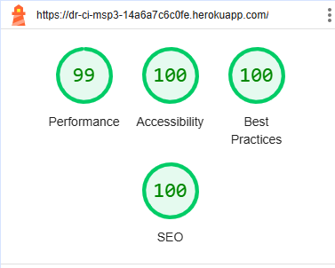
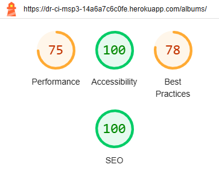
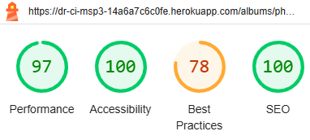
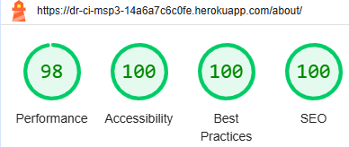
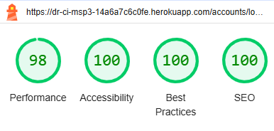
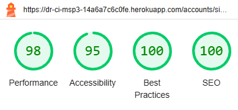
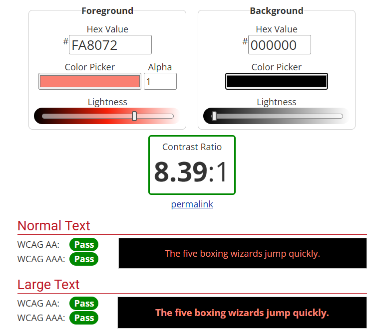
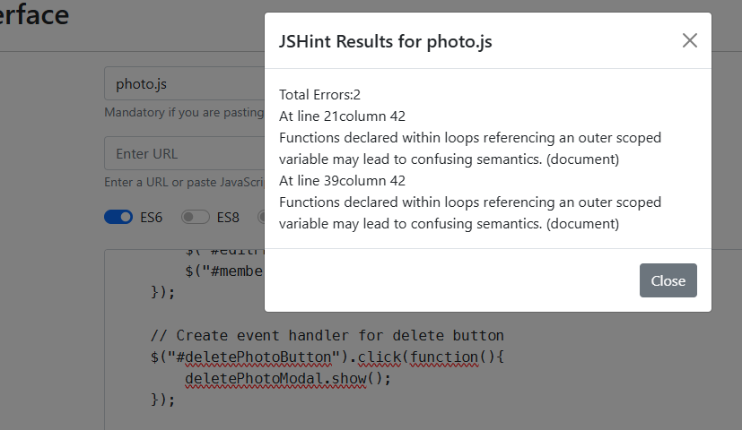
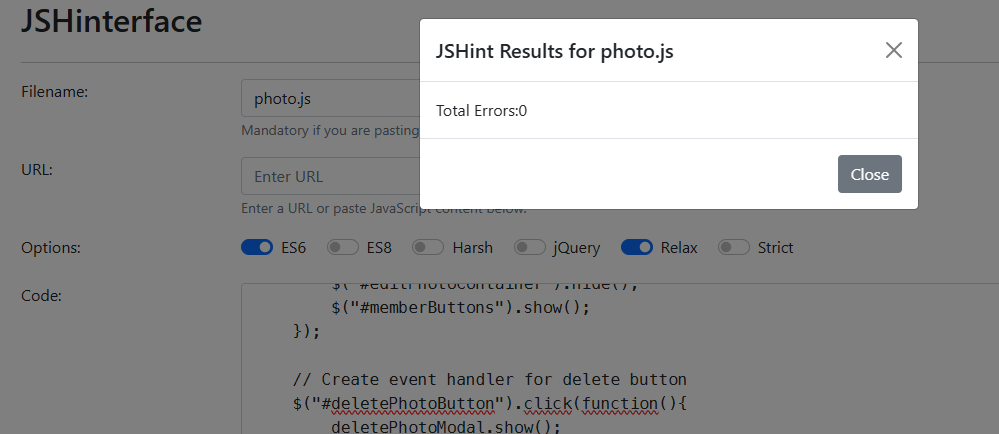

# Milestone Project 3 : The ShutterClickers Photo Club

## Full validation report

### HTML Validation with W3C

For all views, the generated HTML-code has been copied from the browsers "View source" function and pasted into the "Validate by direct input form" on [W3C Markup Valiadtion Service](https://validator.w3.org/)

**Home view**

Warnings and errors found and corrected:
- A couple of missing end tags
- Three warnings where sections didn't have headlines (Warning: Section lacks heading. Consider using h2-h6 elements to add identifying headings to all sections, or else use a div element instead for any cases where no heading is needed.) The suggested switch to divs were made. This was for areas holding Hero image and headline, login status and buttons, and viewing django message view §
- Use of "width: 100%" for static gallery image, changed to style="width: 100%"

After these changes, the html validated without errors or warnings

§ This applied to the base.html template, and would therefore show up in all other validations if not already corrected here

**Albums view**

Only one warning was given for this view, and has been left without being corrected

Frankly, this has been left because I (Daniel) does not understand why it is shown here and not in the home view when they have a similar placement. Since it is a warning, it has been left and placed in project backlog to be reviewed in more detail if project is taken up again.

**Album view**

These errors and warnings were given on the first validation, and has been left without being corrected for now

- The errors referring to several elements having the same id comes from having two forms generated by Django in the same view, and both have the field description. In regards to functionality, it doesn't cause a problem. The same forms are not visible at the same time, and the Javascripts associated with the page doesn't access these items. Solutions considered or tried:
    - Searches has been made to find a way to change the id of items genererated with the Django forms but so far no solution has been found. 
    - Use different views so two forms are not generated at the same time. This was ruled out since it would lead to a lesser user experience wating for another server reload instead of dynamically bringing the correct element to view.
    - Change the name of fields in the model. This was ruled out since it requires more knowledge of models and database handling that has been covered so far in the cause, alternatively deleting models and database and start adding all contect from scratch
- The warning about elements as also shown in albums view has been left with the same reasoning

Further examinations of these errors and warnings has been placed in backlog, should the project be continued after submission.

**Photo view**

Errors and warnings handled after validation:

- Two errors ***Error: The aria-labelledby attribute must point to an element in the same document*** were handled. This came from changing names on the two Bootstrap modals in the document without changling these attributes.
- One warning about one section element not having a headline. A h2-headline with contect Comments was added before the comment form and list which solved the warning and also added a better user interface

  
This has been left and placed in backlog, for reasons discussed above.

**About view**

  
These two warnings have been placed in backlog, for reasons discussed above.

### CSS Validation

The css file styles.css was tested in [W3C CSS validation service](https://jigsaw.w3.org/css-validator/)
One instance was found where a rule only had "360x" instead of "360px". After correcting that, the validator approved the document without errors, but with five warnings. 
- One warning comes from not validating imported styling, this relates to the use of Google Fonts.
- The remaing warnings relates to the use of not being able to check CSS variables, due to their dynamic nature.
These warnings can not be worked around with the methods used and have been left without placing them in backlog.

  

(For some reasons, CSS Validator uses a mix of English and Swedish due to my language settings.)

### Lighthouse reports

All views were tested with a logged in member user (where possible) since these views contains the most elements and objects and are likely to cause the most load on the server.  
All SEO results first came up with a score of 91, due to the fact that meta description had been forgotten. After adding a suitable meta descripton in the template base.html, this was corrected for all genereated views.

***Home view***  

**Albums view**  

**Photo view**  

**About view**  

**Login view**  

**Logout view**  

**Signup view**  

**About test results**
- **Performance:** The performance on album view is the lowest one. The performance score on album and photo views may vary depending on the number of photographs and the size of them. Since there would be many different members uploading images, the size and even the format may vary. One way to work on this would be to dive deeper into Cloudinary settings, since Cloudinary seems to have settings that can govern maximum size. However, there hasn't been time to look into this during this project.
- **Assessibility:** The drop from 100 to 95 is due to a warning of low contrast between the black background and the salmon color used for urls. A second check was done with contrast checkers found on [Webaim](https://webaim.org/) and since the page and colors passed their checks, they have been left as is. (see picture below)
- **Best practices:** Best practices were first even lower, due to the fact that images from cloudinary was loaded with http:// instead of https://. After adjusting this, the score rised to it's current setting of 78. The remaining issues are with third party cookies from Cloudinary, and Javascript being imported from outside sites (JQuery and Bootstrap). Running the test in Chrome Incognito mode brings the score up 100, so there is not much more to be done given the technique used for the project.
- **SEO:** All SEO results first came up with a score of 91, due to the fact that meta description had been forgotten. After adding a suitable meta descripton in the template base.html, this was corrected for all genereated views.

### Javascript validation

The three Javascript-files albums.js, album.js and photo.js where all tested in JSHint, as deployed on [https://daniel-r-ci.github.io/jshint/](https://daniel-r-ci.github.io/jshint/) after previous Code Institute Code Along lessons. They were tested with option **ES6** enabled.

All files had some missing semicolons that didn't affect functionality. After correcting those, two errors errors of the type ***Functions declared within loops referencing an outer scoped variable may lead to confusing semantics. (document)*** remained in photo.js
  

Accessing outer variables like this isn't an unusal case, and enabling the function **Relaxed** approves the code without errors.  

### Python validation
All .py files written or modified for this project has been tested in [CI Python Linter](https://pep8ci.herokuapp.com/) to check for errors and warnings  
noqa comments has been used in some instances where lines in Python exceeded 79 characters. This has been done with restriction and only in these circumstances:
    - Long strings of data settings, especially in settings.py
    - Long strings of text to be submitted to user interface
    - In urls files where needed, for increased readability and comparison between url's

The following files has been tested
- About app
  - admin.py - No errors found
  - forms.oy - No errors found
  - urls.py - No errors found
  - views.py - No errors found
- Album app
  - admin.py - No errors found
  - forms.py - No errors found
  - models.py - No errors found
  - views.py - No errors found
- Home app
  - urls.py - No errors found
  - views.py - No errors found

  Some warnings may be found in other files created by Django, such as models.py in Home app since Home in current release isn't using any models and is only generating a static html page.

